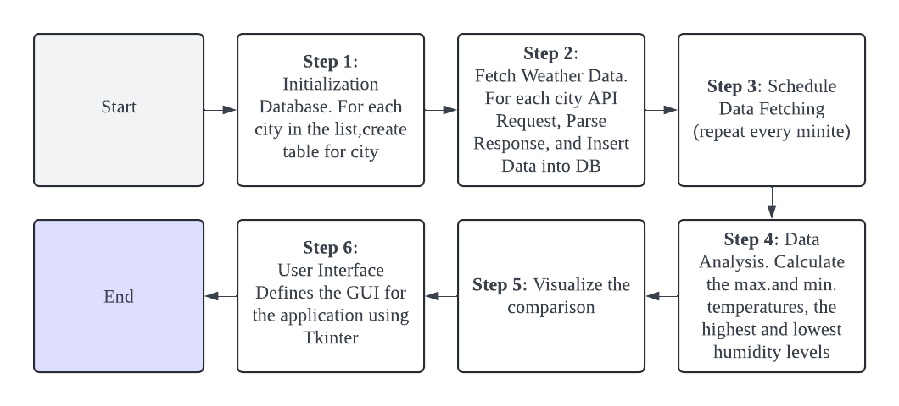
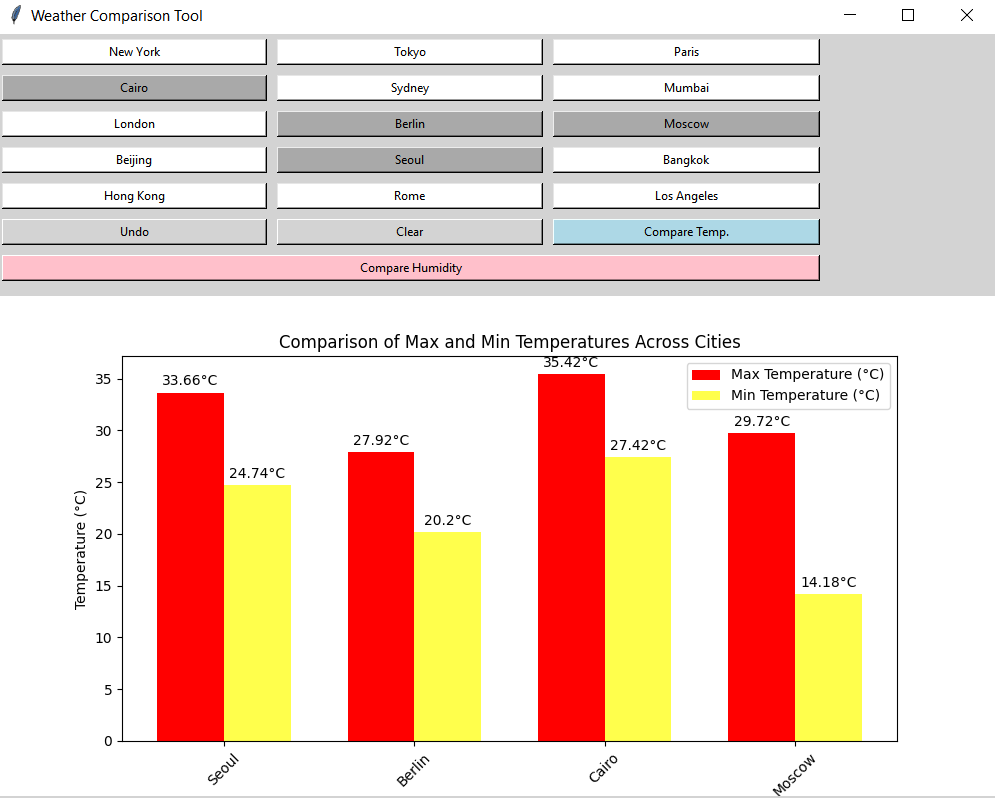
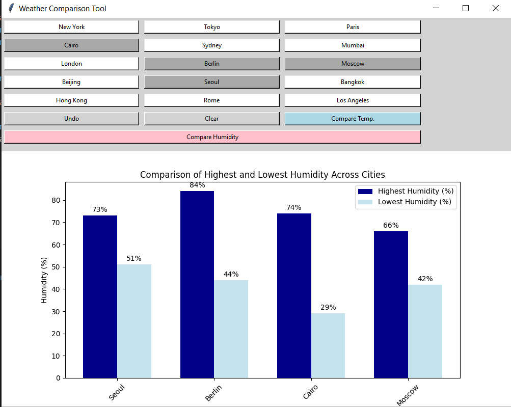

## Introduction/Abstract

This project is aimed at developing a weather data collection and analysis application that fetches, stores, and analyzes weather data for multiple cities. The primary goal is to provide insights into temperature and humidity variations and allow comparisons across different cities.

## Objective

The main objectives of the project include:
- Collecting real-time weather data for a predefined list of cities.
- Storing the fetched data in a local database.
- Analyzing the data to find maximum, minimum, and average temperature and humidity.
- Comparing weather parameters across different cities.
- Providing a user-friendly interface to display the results.
 

## Approach

The project is structured into various tasks, each handling a specific aspect of the application:
1. **Database Initialization**: Setup a SQLite database to store weather data.
2. **Data Collection**: Use OpenWeatherMap API to fetch weather data.
3. **Data Analysis**: Perform statistical analysis on the stored data.
4. **Data Comparison**: Compare weather data across different cities.
5. **User Interface**: Develop a GUI to interact with the data and visualize results.

## Methodology

**Task 0**: API Setup
Description: Set up the API key and endpoint for fetching weather data.  
**Time Estimation: 15 minutes**

**Task 1**: Database Initialization
Description: Initialize a SQLite database and create a table for each city to store weather data including timestamp, temperature, humidity, and weather description. 
**Time Estimation: 15 minutes**

**Task 2**: Data Fetching and Storage
Description: Fetch weather data from OpenWeatherMap API for each city and insert it into the respective city's table. 
**Time Estimation: 30 minutes**

**Task 3**: Data Analysis
Description: Analyze temperature and humidity data by fetching from the database and calculating max/min values. 
**Time Estimation: 30 minutes**

**Task 4**: Graphical Representation
Description: Functions to compare temperature and humidity across multiple cities, plotting results using Matplotlib.  
**Time Estimation: 30 minutes**

**Task 5**: Create Interface to Interact with Data
Description: Develop a graphical user interface using Tkinter to allow users to select cities, view comparisons, and interact with the data. 
**Time Estimation: 3 hours**

## Schema of databases

The application uses SQLite for data storage. Each city has a dedicated table where weather data is stored with the following schema:
 

| Field         | Type                               |
|---------------|------------------------------------|
| **ID**        | INTEGER PRIMARY KEY AUTOINCREMENT |
| **Timestamp** | DATETIME                           |
| **Temperature**| REAL                              |
| **Humidity**  | INTEGER                            |
| **Description**| TEXT                              |
 

## Flowchart
 

 
 

## Interface Design
 

 

 

